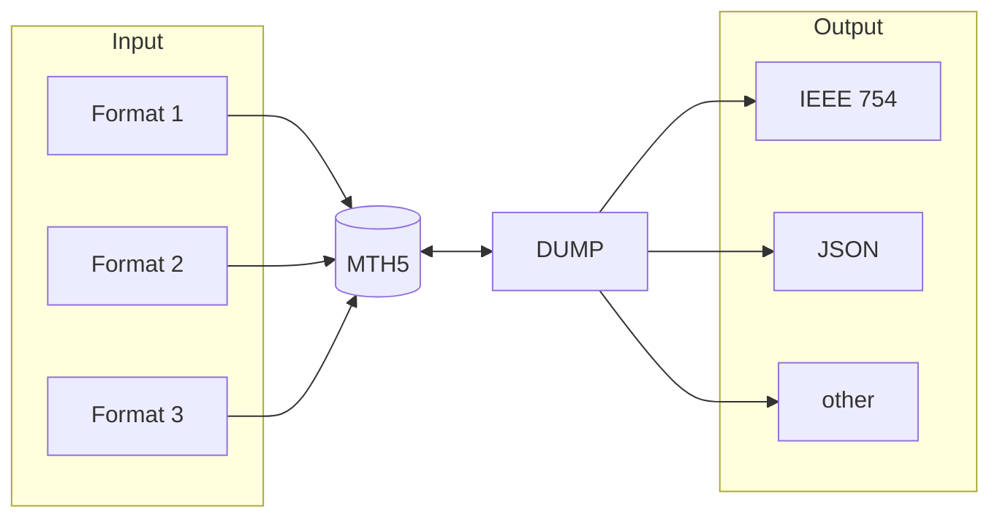

Quick thoughts on data structures.

## Human vs. Machine

Using C/C++ and integer division, the result is three.  
In financial applications, such as your tax declaration, the result is four.  

As instrument engineer, you write kernel drivers and use indices starting at zero.  
You query your ADC from 0 to N-1, because that is a C or assembler code.  

Giant companies with hundreds of developers for your code may add all convenience functions you can think of.  
We can't. We have to keep it simple, or [KISS (keep it simple, stupid)](https://en.wikipedia.org/wiki/KISS_principle).  

From my experience, even in 100 years, the average user takes a text editor and applies changes to the data.
Even though you supplied a fail safe function to do this with the archive format.  

There are two consequences:  
1. The metadata is simple such as JSON.  
2. The data is simple such as a simple *IEEE 754* double number stream.  

Small data, such as calibration data, can be JSON; they are likely to be edited by hand.  

## All in, one out

Since we can not write all convince functions, a good idea is to have a dump format maintained by the archive format programmers, where the
user can manipulate (or destroy) the data.  
In case he is doing right, he can push the data back into a newly created archive.  

## Sub-Formats

As an example [GeoJSON](https://geojson.org/) was mentioned.  
The question is: when it is needed?  
For [DESMEX, ger](https://www.uni-muenster.de/DESMEX/startseite.html) , [DESMEX BGR, eng](https://www.bgr.bund.de/EN/Themen/GG_Geophysik/Aerogeophysik/Projekte/abgeschlossen/DESMEX/DESMEX_en.html) style controlled source measurements, we need detailed information about TX lines.  
Do we need this at the RX site? ... 98% of the users will be exhausted when reading or creating data in this format.  
A "**metadata**" tag could help to keep the data simple. So simply spoken: jump to that URL and use your database, [QGIS](https://qgis.org/), ArcGIS or Oasis montaj   
As long as the user has proprietary information, he can still share the data with the community.  
Or the URL points *inside the MTH5* file.  
**My Experience**: Most of my students have low programming skills; a steep learning curve is not acceptable, they simply ask for "ASCII conversion" ... I am really, really tired of this.  

## Dictionary

Maybe we dump the manufacturer's data into a JSON style storage area into MTH5.  
What does "GSPstat", "LSB", "InputDivOn" mean?  
Sample rate, sampling rate, sample frequency?  
So creating a dictionary (we can have more than one) is a good idea. An example of an embedded sqlite table is [here](../fft/fft.qmd#fft--dft).  
